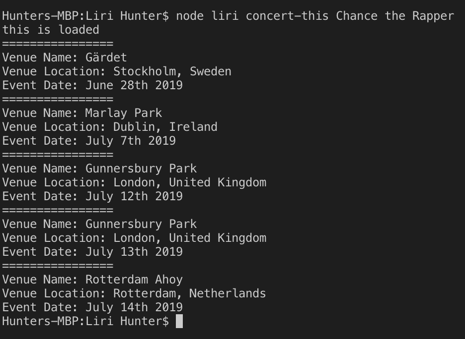
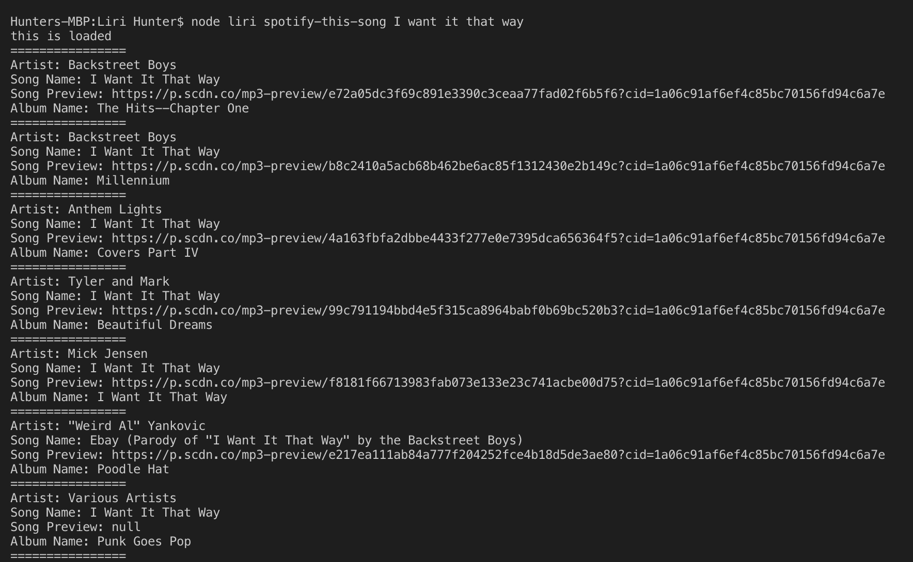
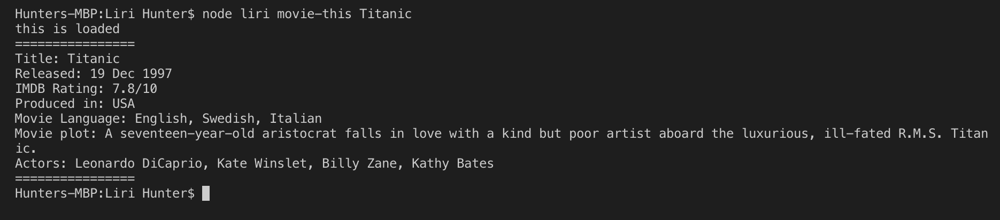
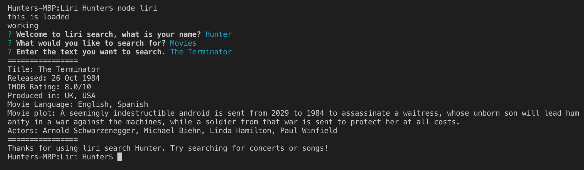

# liri
# To use the Liri search open up your terminal 
# The first thing you need to enter is node liri

# Now you have a choice of there possible commands 
# 1. concert-this (and the name of the artist/group you want to search for)

# 2. spotify-this-song (and the name of the song you want to search for)

# 3. movie-this (and the name of the movie you want to search for)

# You can also just run the command node liri to pull up the liri assistant
# This assistant will help you search without having to use specific commands

